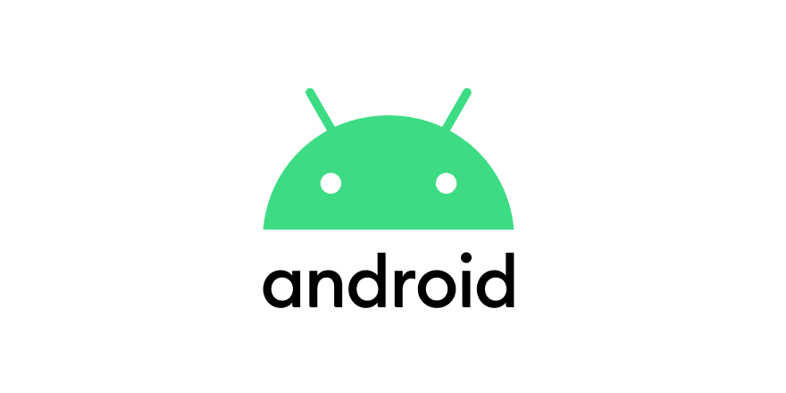
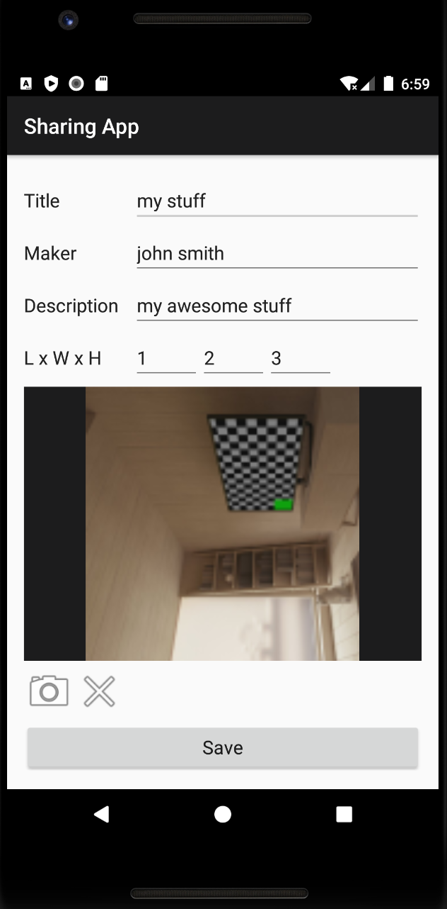
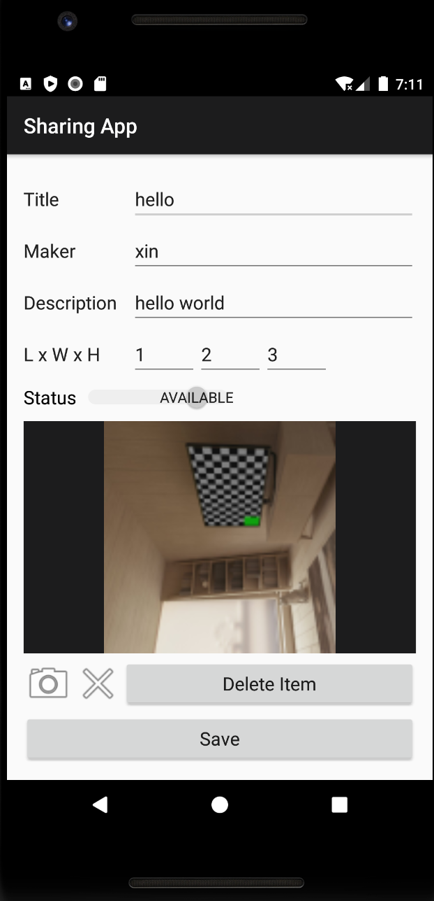
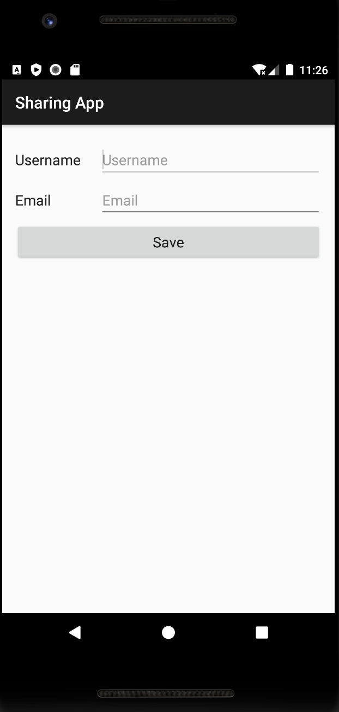
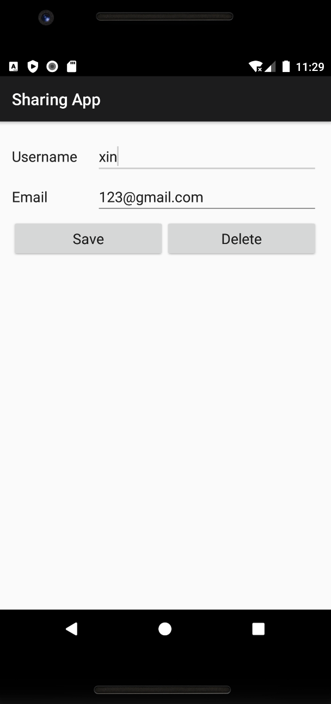

# SharingApp

Social Android application that supports a user to share and connect with people.

## Activities

- AddItemActivity
  - Support the owner to add a thing to its belongs by clicking the "+" sign on the home page, which includes the title, maker, description, and dimentions (Length x Width x Height).
  - Support the owner to optionally attach a photograph to the item.

- EditItemActivity
  - Support the owner to edit the item after long clicking the item, which includes the fields in AddItemActivity along with the item's availability.
  - The action of switching the status of an item between the "Available" and the "Borrowed" status will move the item into the corresponding list view.
  - The owner will be able to update or delete the associated photo.
  - The owner will also be able to edit the name of the borrower here.

- AddContactActivity
  - Support the owner to add contacts with their username and email after clicking the green "+" sign.

- EditContactActivity
  - Support the owner to edit and update the contact information or delete the contact by long clicking the corresponding contact.

## User Stories

### Basics

1. As an owner, I want to add a thing to my things. Each thing is created with title, maker, description, and dimensions (Length x Width x Height).
2. As an owner, I want to view one of my things, its title, maker, description, dimensions and status and if it is being borrowed, the borrower.
3. As an owner, I want to edit a thing in my things.
4. As an owner, I want to delete a thing in my things.

### Lists

1. As an owner, I want to view a list of **all** my belongings, each with their title, description, and status.
2. As an owner, I want to view a list of all my things that are **available**, each with their title and description.
3. As an owner, I want to view a list of my things being **borrowed**, each with their title an description.

### Photographs

1. As an owner, I want to optionally attach a photograph to a thing of mine.
2. As an owner, I want to view any attached photograph for a thing.
3. As an owner, I want to delete any attached photograph for a thing of mine.

### Borrowing

1. As an owner, I want a thing to have a status of one of *Available* or *Borrowed*: I want to set a borrowed thing to be available once it's returned.

### Contacts

1. As an owner, I want to add a contact to my contacts.
2. As an owner, I want to be able to edit a contact in my contacts if that contact is not currently borrowing an item.
3. As an owner, I want to be able to delete a contact in my contacts if that is not currently borrowing an item.

## Glossary

- **user**: a person who uses or operates the app, users are owners
- **owner**: a user who owns the item
- **contact**: each contact has an email and a unique username associated with them, owners can add contacts to their contact list, owners can edit/delete
contacts from their contact list, a contact is a potential borrower
- **contacts**: a list of all contacts an owner has added into the app, these contacts are all potential borrowers
- **borrower**: a contact that borrows an item an eventually returns it to the item's owner
- **item**: an object that is owned by the owner and may be borrowed by a contact in the owner's contact list.
- **item status**: the current state of the item, which defaults to *"Available"* and can be changed at any time by the owner. When an item is borrowed, the owner changes the item's status to *"Borrowed"*, and when the item is returned, the owenr changes the status back to *"Available"*.
- **available**: the item is not currently being borrowed, so it is available to be borrowed.
- **borrowed**: the item is currently borrowed one of the owner's contacts -- a borrower.
- **item list**: a list of items the owner currently has listed, possibily filtered by some condition, i.e., "Available" or "Borrowed".
- **username**: a unique sentence of characters that identifies a contact.
- **item title**: the title of the item.
- **item maker**: the manufacturer, brand or creator of the item.
- **item description**: a brief description of the item. Could be a list of keywords or a sentence.
- **item dimensions**: the length, width and height of the item in cm.

## Acknowledgement

This is based on the capstone project of the Coursera's Object-Oriented Design course created by University of Alberta.
